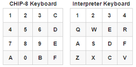

# Yet Another Chip-8 Interpreter

There are many like it, but this one is mine!

I made this as a learning project with Rust and SDL2 and learned a ton. It passes all the tests on the [Timendus Chip-8 Test Suite](https://github.com/Timendus/chip8-test-suite).  so it should work with just about any modern program granted that it targets the original Chip-8 specification.

## Controls

Controls are mapped to the left hand side of the keyboard (should work on all keyboards at the same keys, but not the same letter) and looks like this on a QWERTY keyboard:

The right hand **Return** or **Enter** key acts like reset button. The **Escape** will quit out of the application.

## Settings.toml

In the root directory is a file with some settings for you to adjust. I think I chose reasonable defaults, but it’s a matter of taste for most things.

### Anti-Flicker Pixel Fading

I have included a feature to reduce spite flickering but it does introduce some slight artifacting that can be distracting in a different way. There’s a couple settings in the settings.toml file so play around with it and see if you like it, but I personally can’t play with all the flickering.

### Quirks

If you find that a program doesn’t behave how you’d expect, check out some of the quick flags in settings.toml. It could be that the program is relying on an ambiguous opcode behaviour so I added some toggles for the different behaviors.
